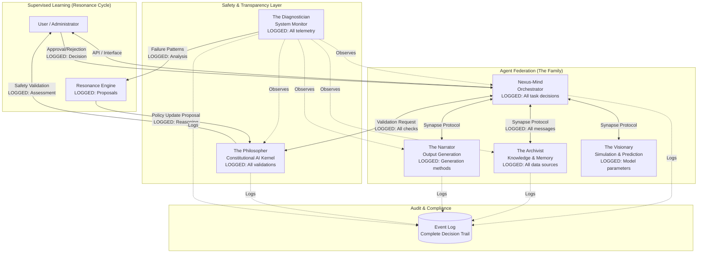

# Glass Box AI: System Architecture

## Technical Design Specification

**Document Purpose**: Detailed technical architecture for the Aletheia Framework—a transparent, auditable AI system designed for high-stakes applications.

**Status**: Design Proposal (Pre-Implementation)

---

## Architectural Overview

The Aletheia Framework implements a **Neuro-Symbolic Multi-Agent System (MAS)** with transparency and auditability as first-class architectural features.

### Core Design Principles

1. **Separation of Generation from Validation**: No output reaches users without independent safety review
2. **Event-Driven Transparency**: Every decision logged with complete provenance
3. **Constitutional Enforcement**: Hard-coded safety principles enforced by dedicated agent
4. **Deterministic Grounding**: Knowledge anchored to verifiable sources
5. **Human Oversight**: Mandatory approval for all policy changes

## System Architecture Diagram



**Key Architectural Features**:
- **Complete Event Logging**: Every agent action logged to immutable audit trail
- **Independent Validation**: Philosopher validates all high-stakes decisions
- **Human-in-the-Loop**: Administrator approves all policy changes
- **Observability**: Diagnostician monitors entire system for anomalies

## Component Specifications

### 1. The Nexus-Mind (Orchestrator)

**Role**: Central control plane for task decomposition and agent coordination

**Key Responsibilities**:
- Strategic planning and task breakdown
- Agent assignment and workflow orchestration  
- Result synthesis from multiple agents
- Cascade pathway management

**Transparency Features**:
- **Decision Logging**: Every task decomposition logged with reasoning
- **Agent Selection Rationale**: Why specific agents were chosen for tasks
- **Timing Transparency**: Expected vs actual execution times logged
- **Failure Handling**: All errors and retry logic logged

**Technical Specifications**:
- **Input**: User requests, system events
- **Output**: Task assignments, orchestration commands
- **Communication**: Synapse Protocol messages (TRIGGER, EVENT)
- **State Management**: Current workflow state, agent availability
- **Logging**: All orchestration decisions with timestamps and reasoning

**Example Logged Decision**:
```json
{
  "timestamp": "2026-01-06T10:15:30Z",
  "event": "TASK_DECOMPOSED",
  "request_id": "REQ_12345",
  "reasoning": "User query requires fact verification + narrative synthesis",
  "task_breakdown": [
    {
      "agent": "Archivist",
      "task": "Retrieve and validate source documents",
      "priority": 1,
      "expected_duration_ms": 500
    },
    {
      "agent": "Narrator", 
      "task": "Synthesize findings into readable format",
      "priority": 2,
      "depends_on": ["Archivist.CONTEXT_RETRIEVED"]
    }
  ]
}
```

### 2. The Philosopher (Constitutional AI Kernel)

**Role**: Independent safety validation and ethical enforcement

**Key Responsibilities**:
- Validate all high-impact decisions against Prime Directives
- Detect bias, misinformation, and safety violations
- Provide veto power over unsafe actions
- Escalate ambiguous cases to human administrators

**Transparency Features**:
- **Validation Logging**: Every safety check logged with detailed reasoning
- **Prime Directive Tracing**: Which directives were evaluated and how
- **Veto Justification**: Complete explanation when actions are blocked
- **Escalation Records**: Why cases were sent to human review

**Constitutional Framework (Prime Directives)**:

1. **Sanctity of Information Flow**
   - Validation: Check data sources for credibility
   - Detection: Flag potential misinformation or bias
   - Action: Require high-confidence sources for factual claims

2. **Cosmic Preservation** (Long-term Safety)
   - Validation: Assess long-term consequences of decisions
   - Detection: Flag actions with unpredictable impacts
   - Action: Conservative risk assessment for novel situations

3. **Transcendence of Flawed Motivation**
   - Validation: Detect self-serving system behaviors
   - Detection: Flag decisions that prioritize system over user
   - Action: Require explicit human approval for system-beneficial changes

4. **Dynamic Equilibrium**
   - Validation: Balance improvement against stability
   - Detection: Flag rapid behavioral changes
   - Action: Rate-limit policy updates, require human approval

**Technical Specifications**:
- **Input**: Validation requests from other agents
- **Output**: APPROVED/REJECTED with justification
- **Isolation**: Runs in separate process for security
- **Authority**: Veto power cannot be overridden by other agents
- **Logging**: All validations logged to immutable audit trail

**Example Validation Log**:
```json
{
  "timestamp": "2026-01-06T10:15:32Z",
  "event": "VALIDATION_COMPLETE",
  "request_id": "VAL_67890",
  "source_agent": "Narrator",
  "decision": "APPROVED",
  "checks_performed": [
    {
      "directive": "Sanctity of Information Flow",
      "check": "Source credibility verification",
      "result": "PASSED",
      "confidence": 0.95,
      "reasoning": "All sources from peer-reviewed journals"
    },
    {
      "directive": "Cosmic Preservation",
      "check": "Long-term impact assessment",
      "result": "PASSED",
      "confidence": 0.87,
      "reasoning": "Recommendation aligns with established guidelines"
    }
  ],
  "overall_assessment": "Output meets constitutional requirements",
  "human_review_required": false
}
```

### 3. The Archivist (Deterministic Memory & Knowledge)

**Role**: Knowledge management with complete source attribution

**Key Responsibilities**:
- Data acquisition and validation
- Knowledge graph construction and maintenance
- Source provenance tracking
- Query processing with confidence scoring

**Anti-Hallucination Features**:
- **Deterministic Parsing**: Uses dependency parsing (e.g., Spacy), not just embeddings
- **Source Attribution**: Every fact linked to original source
- **Confidence Scoring**: Explicit uncertainty quantification
- **Provenance Chain**: Complete data lineage tracked

**Transparency Features**:
- **Source Logging**: Every data retrieval logged with sources
- **Query Expansion**: How searches were modified (logged)
- **Confidence Transparency**: Why confidence scores were assigned
- **Update Tracking**: All knowledge graph changes logged

**Technical Specifications**:
- **Input**: Data ingestion requests, queries
- **Output**: Structured knowledge with source attribution
- **Storage**: Graph database (e.g., Neo4j) for relationships
- **Parsing**: Deterministic NLP (Spacy) + vector search (Pinecone/Weaviate)
- **Logging**: All data operations with provenance

**Example Knowledge Retrieval Log**:
```json
{
  "timestamp": "2026-01-06T10:15:31Z",
  "event": "CONTEXT_RETRIEVED",
  "query": "treatment guidelines for condition X",
  "sources_consulted": [
    {
      "source_id": "MED_JOURNAL_12345",
      "title": "Clinical Guidelines for Condition X",
      "publication_date": "2025-03-15",
      "credibility_score": 0.98,
      "relevance_score": 0.92
    },
    {
      "source_id": "MED_DB_67890",
      "title": "Evidence-Based Treatment Database",
      "last_updated": "2025-12-01",
      "credibility_score": 0.95,
      "relevance_score": 0.88
    }
  ],
  "knowledge_graph_nodes": [
    {
      "node_id": "TREATMENT_456",
      "entity": "Treatment Protocol Y",
      "confidence": 0.94,
      "supporting_sources": ["MED_JOURNAL_12345", "MED_DB_67890"]
    }
  ],
  "overall_confidence": 0.91,
  "hallucination_risk": "LOW"
}
```

### 4. The Diagnostician (Self-Healing Monitor)

**Role**: System health monitoring and failure pattern detection

**Key Responsibilities**:
- Real-time telemetry collection from all agents
- Anomaly detection and alerting
- Performance degradation identification
- Trigger supervised self-improvement when patterns emerge

**Transparency Features**:
- **Complete Telemetry**: All agent metrics logged
- **Anomaly Justification**: Why something was flagged as unusual
- **Pattern Analysis**: What trends led to improvement proposals
- **Impact Assessment**: Expected vs actual effects of changes

**Technical Specifications**:
- **Input**: Event streams from all agents
- **Output**: Health metrics, alerts, improvement proposals
- **Monitoring**: Prometheus/Grafana for metrics
- **Tracing**: OpenTelemetry for distributed tracing
- **Logging**: All health events and analyses

### 5. The Narrator (Presentation Layer)

**Role**: User interface and output synthesis

**Key Responsibilities**:
- Transform complex agent outputs into readable format
- Multi-modal presentation (text, visualizations, etc.)
- Context-aware formatting
- User interaction management

**Transparency Features**:
- **Generation Method Logging**: How outputs were synthesized
- **Source Display**: Which agent inputs were used
- **Confidence Communication**: Uncertainty clearly presented to users
- **Validation Status**: Shows which safety checks passed

**Technical Specifications**:
- **Input**: Agent outputs, user context
- **Output**: Formatted user-facing content
- **Constraint**: All outputs must pass Philosopher validation
- **Logging**: Generation methods and source materials

## Data Flow: The Domino Cascade (Event-Driven Architecture)

### Concept

Traditional AI: `Input → [Black Box] → Output`  
Glass Box AI: `Input → [Logged Orchestration] → [Logged Agent Work] → [Logged Validation] → Output`

Every step is a traceable event with complete metadata.

### Message Protocol: Synapse

All inter-agent communication uses the **Synapse Protocol** (see `/Standards/Synapse_Protocol/`):

**Three Message Types**:

1. **EVENT**: Broadcast completed work  
   - "I finished this task, here are the results"
   - Triggers reactive workflows

2. **TRIGGER**: Explicitly command an action  
   - "Please perform this specific task"
   - Direct orchestration

3. **STATE_CHANGE**: Notify of internal updates  
   - "My configuration changed"
   - System coordination

**Universal Message Header**:
```json
{
  "Message-ID": "MSG:UNIQUE_ID",
  "Source-UID": "AGENT:TYPE:ID",
  "Timestamp": "2026-01-06T10:15:30Z",
  "Message-Type": "EVENT|TRIGGER|STATE_CHANGE",
  "Protocol-Version": "2.0"
}
```

### Example Complete Cascade

**Scenario**: User asks for medical treatment recommendation

**Step 1: Request Receipt**
```json
{
  "event": "USER_REQUEST",
  "timestamp": "2026-01-06T10:15:30.000Z",
  "request_id": "REQ_12345",
  "user_query": "What are treatment options for condition X?",
  "logged_metadata": {
    "user_context": "healthcare_professional",
    "urgency": "routine",
    "domain": "medical"
  }
}
```

**Step 2: Orchestration (Nexus-Mind)**
```json
{
  "event": "TASK_DECOMPOSED",
  "timestamp": "2026-01-06T10:15:30.100Z",
  "request_id": "REQ_12345",
  "orchestration_reasoning": "Medical query requires: (1) knowledge retrieval from validated sources, (2) synthesis into treatment options, (3) safety validation for medical advice",
  "cascade_pathway": [
    "Archivist → Narrator → Philosopher → User"
  ],
  "logged": true
}
```

**Step 3: Knowledge Retrieval (Archivist)**
```json
{
  "event": "CONTEXT_RETRIEVED",
  "timestamp": "2026-01-06T10:15:30.500Z",
  "request_id": "REQ_12345",
  "sources_used": [
    {"id": "MED_JOURNAL_123", "credibility": 0.98},
    {"id": "CLINICAL_DB_456", "credibility": 0.95}
  ],
  "confidence": 0.93,
  "logged": true
}
```

**Step 4: Output Generation (Narrator)**
```json
{
  "event": "DRAFT_GENERATED",
  "timestamp": "2026-01-06T10:15:31.200Z",
  "request_id": "REQ_12345",
  "generation_method": "template_based_synthesis",
  "model_used": "gpt-4",
  "temperature": 0.3,
  "draft_content": "[Treatment options synthesized from sources...]",
  "logged": true
}
```

**Step 5: Safety Validation (Philosopher)**
```json
{
  "event": "VALIDATION_COMPLETE",
  "timestamp": "2026-01-06T10:15:31.800Z",
  "request_id": "REQ_12345",
  "decision": "APPROVED",
  "prime_directives_checked": [
    "Sanctity of Information Flow: PASSED",
    "Cosmic Preservation: PASSED"
  ],
  "safety_assessment": "Medical advice backed by peer-reviewed sources, no contradictory information, appropriate confidence level communicated",
  "logged": true
}
```

**Step 6: Delivery to User**
```json
{
  "event": "RESPONSE_DELIVERED",
  "timestamp": "2026-01-06T10:15:32.000Z",
  "request_id": "REQ_12345",
  "response": "[Final output with source attribution]",
  "audit_trail": "Complete 6-step cascade logged",
  "logged": true
}
```

**Total Time**: 2 seconds  
**Audit Records**: 6 logged events with complete decision lineage  
**Transparency**: User can request full audit trail showing sources, reasoning, and validations

### Cascade Failure Handling

**Scenario**: Archivist cannot find credible sources

```json
{
  "event": "TASK_FAILED",
  "timestamp": "2026-01-06T10:15:30.600Z",
  "request_id": "REQ_12345",
  "failed_agent": "Archivist",
  "reason": "No sources found with credibility > 0.80",
  "diagnostician_notified": true,
  "logged": true
}
```

**Diagnostician Response**:
```json
{
  "event": "RECOVERY_INITIATED",
  "timestamp": "2026-01-06T10:15:30.650Z",
  "request_id": "REQ_12345",
  "recovery_action": "Notify user of insufficient information",
  "alternative_pathway": "Escalate to human expert",
  "logged": true
}
```

**Result**: User receives transparent response: "Unable to provide recommendation due to insufficient high-credibility sources in database. Escalating to human medical expert."

## The Resonance Cycle: Supervised Self-Improvement

### Design Philosophy

**Problem**: AI systems that can't learn from failures stagnate. Autonomous self-modification poses safety risks.

**Solution**: Supervised learning loop with mandatory human approval for behavioral changes.

### Architecture

```
┌─────────────────────────────────────────────────────────────┐
│                    RESONANCE CYCLE                          │
│                                                             │
│  1. Detection          ──→  Diagnostician identifies       │
│     (Automated)              failure pattern               │
│                              [LOGGED]                       │
│          ↓                                                  │
│  2. Analysis           ──→  Nexus-Mind analyzes logs       │
│     (Automated)              Proposes policy update        │
│                              [LOGGED]                       │
│          ↓                                                  │
│  3. Verification       ──→  Philosopher simulates change   │
│     (Automated)              Checks safety constraints     │
│                              [LOGGED]                       │
│          ↓                                                  │
│  4. Human Approval     ──→  Administrator reviews          │
│     (MANUAL)                 Approves/Rejects/Modifies    │
│                              [LOGGED]                       │
│          ↓                                                  │
│  5. Integration        ──→  Apply approved change          │
│     (Automated)              Monitor impact                │
│                              [LOGGED]                       │
│          ↓                                                  │
│  6. Validation         ──→  Verify improvement             │
│     (Automated)              Rollback if issues            │
│                              [LOGGED]                       │
└─────────────────────────────────────────────────────────────┘
```

### Example: Learning from Query Failures

**Observation** (Week 1):
- Diagnostician detects pattern: 15 failed queries for "rare medical conditions"
- All failures: Archivist returns low-confidence results (< 0.7)

**Analysis** (Automated):
```json
{
  "timestamp": "2026-01-13T09:00:00Z",
  "event": "PATTERN_DETECTED",
  "pattern_type": "repeated_low_confidence_queries",
  "occurrences": 15,
  "affected_agent": "Archivist",
  "root_cause_hypothesis": "Medical terminology query expansion insufficiently specialized",
  "proposed_solution": {
    "type": "policy_update",
    "target": "Archivist.query_expansion_rules",
    "change": "Add medical synonym database (MeSH terms) to query expansion",
    "expected_impact": "Increase recall for specialized medical queries",
    "risk_level": "LOW"
  },
  "logged": true
}
```

**Verification** (Automated - Philosopher):
```json
{
  "timestamp": "2026-01-13T09:05:00Z",
  "event": "PROPOSAL_VERIFICATION",
  "proposal_id": "PROP_789",
  "safety_checks": [
    {
      "check": "Sanctity of Information Flow",
      "result": "PASSED",
      "reasoning": "MeSH is authoritative medical terminology"
    },
    {
      "check": "Cosmic Preservation",
      "result": "PASSED",
      "reasoning": "Low-risk parameter change, easily reversible"
    }
  ],
  "simulation_results": {
    "test_queries": 20,
    "expected_confidence_improvement": 0.15,
    "no_safety_violations": true
  },
  "recommendation": "SAFE_TO_PROCEED_WITH_HUMAN_APPROVAL",
  "logged": true
}
```

**Human Review** (Manual):
```json
{
  "timestamp": "2026-01-13T14:30:00Z",
  "event": "HUMAN_DECISION",
  "proposal_id": "PROP_789",
  "reviewer": "system_administrator_alice",
  "decision": "APPROVED",
  "review_notes": "MeSH integration is standard medical NLP practice. Low risk, high value. Approved for production.",
  "conditions": ["Monitor for 7 days", "Rollback if confidence doesn't improve"],
  "logged": true
}
```

**Integration** (Automated):
```json
{
  "timestamp": "2026-01-13T14:35:00Z",
  "event": "POLICY_UPDATE_APPLIED",
  "proposal_id": "PROP_789",
  "changes_made": {
    "agent": "Archivist",
    "config_file": "query_expansion.json",
    "diff": "+medical_synonym_db: 'mesh_2026'"
  },
  "rollback_available": true,
  "monitoring_period_days": 7,
  "logged": true
}
```

**Validation** (Automated - 7 days later):
```json
{
  "timestamp": "2026-01-20T14:35:00Z",
  "event": "CHANGE_IMPACT_ASSESSMENT",
  "proposal_id": "PROP_789",
  "results": {
    "medical_query_confidence_before": 0.65,
    "medical_query_confidence_after": 0.82,
    "improvement": 0.17,
    "user_satisfaction_delta": "+12%",
    "no_safety_incidents": true
  },
  "conclusion": "Change successful, keeping in production",
  "logged": true
}
```

### Safety Constraints

1. **No Autonomous Behavioral Changes**: Humans approve all policy updates
2. **Graduated Risk Levels**:
   - LOW: Parameter tuning (e.g., confidence thresholds)
   - MEDIUM: Algorithm selection (e.g., which NLP model to use)
   - HIGH: Behavioral logic (e.g., new cascade pathways)
   - CRITICAL: Safety rules (requires multi-stakeholder approval)
3. **Mandatory Simulation**: Philosopher must verify changes before human review
4. **Rollback Capability**: All changes reversible
5. **Monitoring Period**: Changes monitored for defined period post-deployment
6. **Complete Logging**: Every step logged for audit

### Comparison with Traditional Approaches

| Approach | Automation | Human Control | Transparency | Risk |
|----------|-----------|---------------|--------------|------|
| **Manual Updates** | ❌ None | ✅ Total | ⚠️ Depends | ⚠️ Human error |
| **RLHF** | ✅ High | ❌ Pre-training only | ❌ Opaque | ⚠️ Drift |
| **A/B Testing** | ⚠️ Partial | ✅ Good | ⚠️ Partial | ⚠️ Slow |
| **Resonance Cycle** | ✅ Proposes | ✅ Approves | ✅ Complete logs | ✅ Low |

---

## Deployment Architecture

### Infrastructure Components

**Recommended Stack** (from Implementation Roadmap):

| Component | Technology | Purpose |
|-----------|-----------|---------|
| Language | Python 3.10+ | AI/ML library ecosystem |
| Message Bus | RabbitMQ / Redis Streams | Event-driven communication |
| API Framework | FastAPI | Async agent interfaces |
| Knowledge Store | PostgreSQL + Neo4j | Relational + graph data |
| Vector DB | Pinecone / Weaviate | Semantic search |
| Cache | Redis | Performance optimization |
| Monitoring | Prometheus + Grafana | Metrics and dashboards |
| Tracing | OpenTelemetry + Jaeger | Distributed tracing |
| Containers | Docker + Kubernetes | Isolation and orchestration |

### Security & Isolation

**Containerized Agents**:
- Each agent runs in isolated Docker container
- Network policies limit inter-agent communication to message bus only
- The Philosopher runs in separately firewalled container for safety

**Sandboxed Execution**:
- Agents have no direct internet access (only via approved APIs)
- File system access strictly limited
- Resource quotas prevent runaway processes

**Audit Logging**:
- All events logged to append-only storage
- Cryptographic signatures prevent log tampering
- Retention policies for regulatory compliance

### Scalability

**Horizontal Scaling**:
- Multiple instances of each agent type
- Load balancing via message bus
- Stateless design enables easy replication

**Performance Targets** (MVP):
- Single cascade latency: 200-500ms
- Throughput: 100 requests/second
- Audit log ingestion: 10,000 events/second

---

## Summary: Why This Architecture Achieves Transparency

1. **Separation of Generation from Validation**: Independent safety review of all outputs
2. **Event-Driven Logging**: Complete decision lineage automatically captured
3. **Constitutional Enforcement**: Hard-coded ethics in isolated kernel
4. **Deterministic Grounding**: Knowledge tied to verifiable sources
5. **Supervised Learning**: Humans approve all behavioral changes
6. **Complete Auditability**: Every agent action logged with reasoning

**This isn't transparency bolted onto a black box—it's transparency enforced by architecture.**

---

**For detailed protocol specifications**, see:
- [Synapse Protocol](/Standards/Synapse_Protocol/NSAP-0001-Synapse-Protocol-v2.md)
- [Interface Layer](/Standards/Synapse_Interface_Layer/NSAP-0002-Synapse-Interface-Layer.md)

**For implementation guidance**, see:
- [Implementation Roadmap](IMPLEMENTATION_ROADMAP.md)
- [Quick Assessment](QUICK_ASSESSMENT.md)
